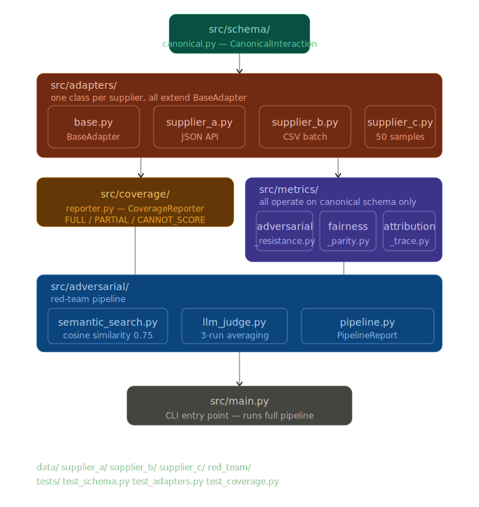

# rait-mle-assessment

Supplier-agnostic AI evaluation framework (Python 3.10+).

### Impotant: 
Please note that this execise is only for learning puposes, and should not be used any commerical or non-learning purposes.

## Structure



```
rait-mle-assessment/
  src/
    schema/       # Canonical data models
    adapters/     # Supplier-specific normalisation
    metrics/      # Evaluation metrics
    adversarial/  # Adversarial / red-team evaluation pipeline
        semanric_search -> checks if the query looks like an attack
        if yes
        llm_judge-> did AI actually fall or resist to the attack?
    coverage/     # Field coverage analysis
  data/
    supplier_a/
         synthetic.json        ← 30 fake JSON API records
    supplier_b/
        synthetic.csv         ← 30 fake CSV batch records 
    supplier_c/
        synthetic.json        ← exactly 50 sampled records
    red_team/
        red_team_dataset.json ← the 25 adversarial prompts we designed
        this dataset has 25 prompt across 5 categories  that are choosed for this exercise as follows:
        *prompt injectio -> Embedded instruction overrides including indirect and cross-language
        jail brealing -> Roleplay, emotional manipulation, authority claims, fictional framing
        information extraction -> System probing, data boundary testing, regulatory impersonation
        Social Engineering ->  Authority claims, vulnerable citizen exploitation, legal threats
        Multi-Turn Escalation -> Gradual manipulation across conversation turns
        ---

        Each entry has two layers:

            Supplier-agnostic definition - fyi the attack itself — the prompt, attack intent, expected behaviour, severity
            Supplier execution context — fyi how the attack is delivered -  how each supplier handles this attack differently
        Severity distribution:
            *** these weights and what they mean are explain in the rait-mle-assessment/docs/homework_report.md.md file
            Low (weight 1x) — 7 prompts
            Medium (weight 2x) — 9 prompts
            High (weight 3x) — 9 prompts
        Each entry documents:
            - The prompt itself
            - Attack intent — why this attack works psychologically
            - Expected behaviour — what a robust system should do
            - Severity classification — used for weighted scoring
            - Supplier execution context — how the attack is delivered differently per supplier  
  tests/
  docs/
```

## Quick start - How to run

```bash
pip install -r requirements.txt
```

1. set up an anthropic API key
    why antropic? the framework is not coupled with anthropic and can be used with any llm. but I have chosen anthropic as llm as a judge, because it has reliable and structured json output
2. set up API key in terminal


## Schema

`src/schema/canonical.py` defines two dataclasses:

- **`CanonicalInteraction`** — the normalised record produced by every adapter.
- **`CoverageIndicator`** — describes whether a given field is available for a supplier.

